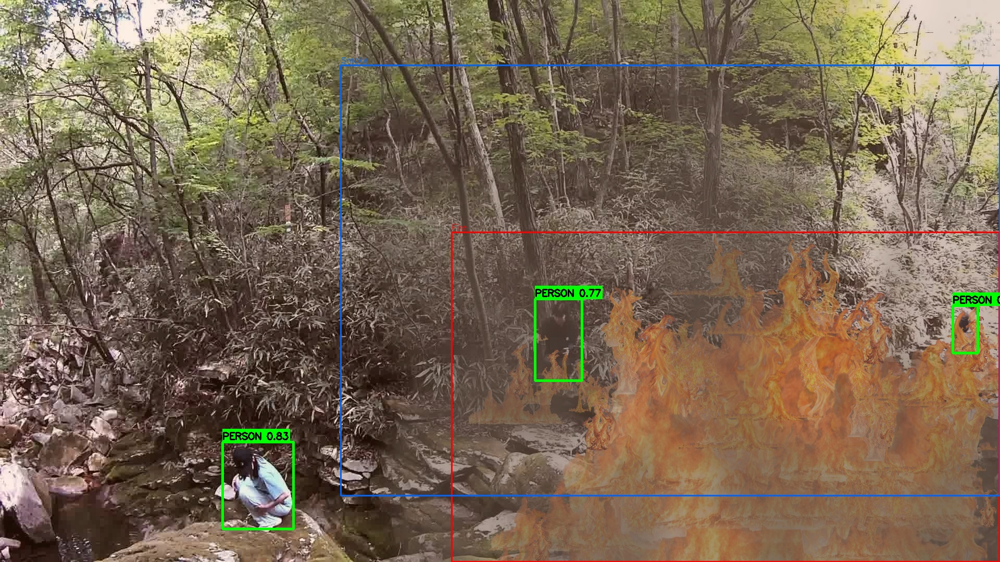
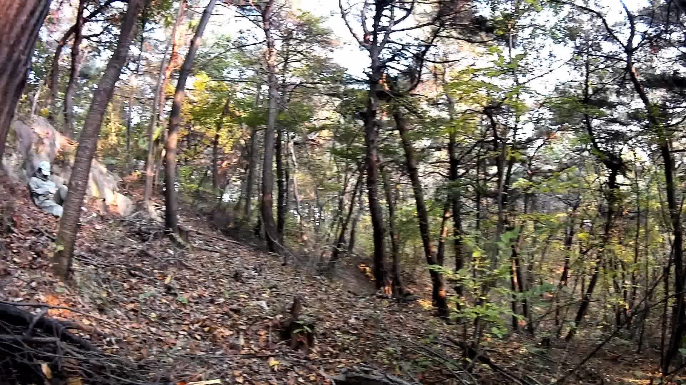
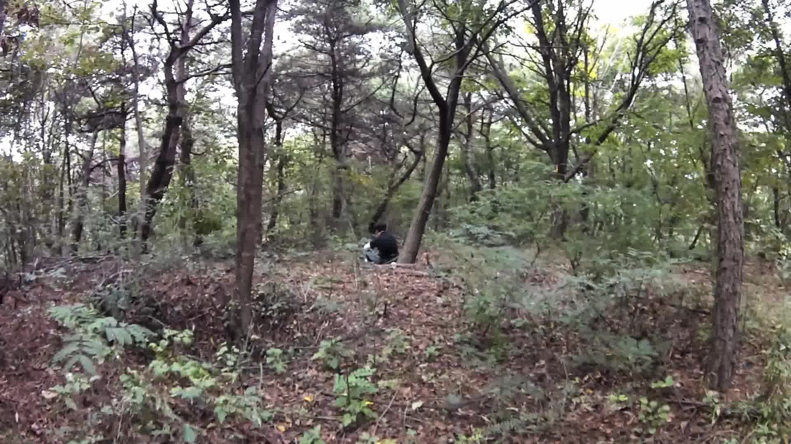
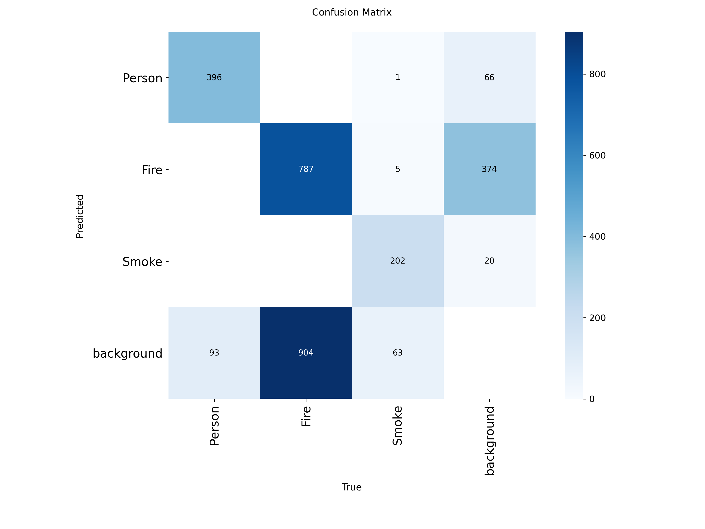

# 🔥🚁 Drone For Your Safety: Aerial Wildfire Survivor Detection
### Final Project | B.Sc. Computer Science @ HIT


> **"Human Safety is Priority #1":** A computer vision system for UAVs that prioritizes survivor detection in low-visibility wildfire environments.

---

## 1. Project motivation
**The Challenge:** During massive wildfires, aerial visibility is severely degraded by thick smoke. While drones are often used to monitor the fire itself, identifying trapped survivors (Survivors) remains a critical operational gap.
**The "Why":** Standard models fail to distinguish a person from the chaotic background of a fire. Our goal was to build a system that prioritizes human life above all else, providing rescue teams with precise coordinates even in zero-visibility zones.

## 2. Problem statement
Developing a reliable detection model for this task faced two major hurdles:
1.  **Data Scarcity:** Real drone footage of people trapped in wildfires is (fortunately) extremely rare. Without data, standard AI models cannot be trained.
2.  **Class Imbalance:** In a forest fire image, "Fire" and "Smoke" occupy 90% of the pixels. A standard model would ignore the small, obscured human figure. Our solution had to force the model to focus on the minority class (Person).

## 3. Visual abstract
The system's output demonstrates our priority-based inference: Survivors (Green) are detected and drawn on the top layer, ensuring they are never obscured by the Fire (Red) or Smoke (Blue) bounding boxes.



## 4. Datasets used or collected
Since no public dataset existed for "People trapped in aerial forest fires," we engineered our own using a hybrid approach. This allowed us to simulate extreme weather conditions (Snow, Summer, Autumn) to ensure the model is robust and not prone to domain shift.

### Dataset Access
📥 **[Download Full Dataset via Google Drive](https://drive.google.com/drive/folders/1kZQuPvdQsVk4eyn9Zfe5TqVohha8QSg6?usp=sharing)**

## 5. Data augmentation and generation methods
We developed a **Hybrid Data Generation Pipeline** to create 2,500+ high-quality training images:

1.  **Synthetic Compositing (70%):** We wrote a custom Python engine (`synthetic_compositing.py`) that procedurally injects transparent fire/smoke assets into clean forest backgrounds. This gives us pixel-perfect labels automatically.
2.  **Generative AI (10%):** We used Stable Diffusion 1.5 with ControlNet (Canny/Depth) to generate hyper-realistic lighting and smoke interactions that simple compositing cannot achieve.
3.  **Clean Images (20%):** We included negative samples (forests without fire) to drastically reduce False Positives.


*Example: Stable Diffusion generation used for realistic smoke effects.*

## 6. Input/Output Examples
Below is a demonstration of our **Synthetic Compositing** method. We take clean forest environments (Input) and procedurally generate hazardous conditions with automatic labeling (Output).


*Left: Clean Input. Right: Generated output with 'Person', 'Fire', and 'Smoke' labels.*

## 7. Models and pipelines used
* **Architecture:** **YOLOv11** (Ultralytics). We chose v11 over v8 after benchmarking showed a significant improvement in Recall for small objects.
* **Pipeline:**
    1.  Data Generation (Stable Diffusion + Compositing Script).
    2.  Auto-Labeling (HSV Thresholding & Coordinate Mapping).
    3.  Training (Transfer Learning from COCO weights).
    4.  Inference (Custom script with layer prioritization).

## 8. Training process and parameters
* **Hardware:** Trained on **2x NVIDIA T4 GPUs** (Kaggle Environment).
* **Configuration:** 100 Epochs, Image Size 640px, Batch Size 16.
* **Optimization:** Best weights were saved at **Epoch 90**, showing that the model converged well without overfitting.

## 9. Metrics
In Search & Rescue, **Recall** (finding all survivors) is more important than Precision. Our YOLOv11 model achieved **82% mAP** for the "Person" class, outperforming the environmental classes.

| Class | Precision | Recall | mAP50 |
| :--- | :---: | :---: | :---: |
| **All Classes** | 76.8% | 72.3% | 73.5% |
| **🔥 Fire** | 72.1% | 68.5% | 70.1% |
| **☁️ Smoke** | 73.9% | 68.8% | 68.4% |
| **🧍 Person (Critical)** | **84.4%** | **79.6%** | **82.0%** |

## 10. Results
The Confusion Matrix below confirms the model's reliability. It shows minimal confusion between "Fire" and "Person," proving that the model successfully learned to distinguish human features even in fiery environments.



## 11. Repository structure

```bash
├── assets/                   # Images for this README
├── src/
│   ├── synthetic_compositing.py  # MAIN TOOL: Generates synthetic fire dataset
│   ├── auto_labeling.py          # Helper: Auto-generates YOLO labels
│   ├── inference.py              # MAIN TOOL: Runs detection on new images/video
│   └── __init__.py
├── notebooks/
│   ├── 01_Stable_Diffusion_Generation.ipynb  # Research: GenAI pipeline
│   └── 02_YOLO_Training.ipynb                # Research: Training & Eval
├── models/
│   └── best.pt               # The trained YOLOv11 weights
├── requirements.txt          # Python dependencies
└── README.md                 # Documentation

## 12. Team Members
**Rachel Sade, Yuval Pery, Shaked Horesh**
* **Institution:** Holon Institute of Technology (HIT)
* **Faculty:** Computer Science
* **Focus:** Computer Vision, Deep Learning, & Digital Forensics.

---

# 👩‍💻 How to Run This Project

### 1. Installation
Clone the repo and install dependencies:
```bash
git clone [https://github.com/YourUsername/Drone-For-Your-Safety.git](https://github.com/YourUsername/Drone-For-Your-Safety.git)
cd Drone-For-Your-Safety
pip install -r requirements.txt

### 2. Run Detection (Inference)
To detect survivors in an image using our trained model:
```bash
python src/inference.py --source data/test_video.mp4 --weights models/best.pt

### 3. Generate New Synthetic Data
To create your own fire dataset using our engine:
```bash
python src/synthetic_compositing.py --input_dir data/forest_images --output_dir data/generated_fire

<p align="center"><i>Developed for the purpose of saving lives using open-source AI technology.</i></p>